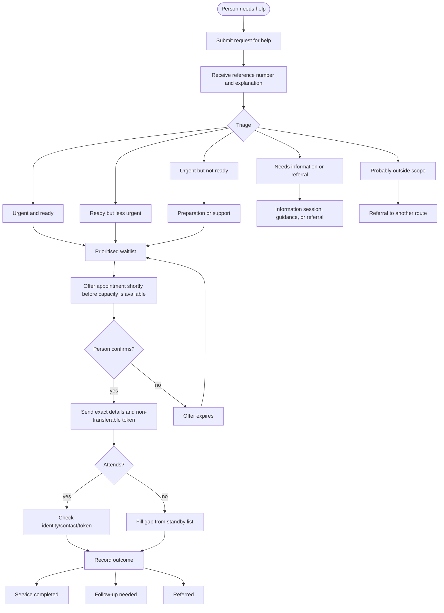

Appointment systems are often treated as a scheduling problem: create slots, let people book them, and process whoever turns up.

In high-demand civic services, that model fails quickly.

When appointments are scarce, open booking systems can become informal markets. People refresh websites, intermediaries hoard slots, appointments are resold, users book speculatively, no-shows rise, and people without time, money, language skills, or digital access are pushed out.

For services used by vulnerable people, the design question is not simply:

> How do we let people book appointments?

The better question is:

> How should scarce service capacity be allocated fairly, efficiently, and safely?

This distinction matters. A normal booking calendar assumes that the fairest person to receive a slot is the person who got there first. In overloaded civic contexts, that assumption is usually wrong.

## Summary

The strongest model is managed access:

```text
request help
→ triage need and readiness
→ place the person in a managed queue
→ offer an appointment shortly before capacity is available
→ require confirmation
→ issue a non-transferable attendance token
→ check in
→ fill gaps from a standby list
→ record the outcome
```

This is different from open self-booking:

```text
publish slots
→ fastest people or bots take them
→ some slots are resold
→ many people do not attend
→ vulnerable people queue physically
→ staff capacity is wasted
```

The goal should be:

> completed service outcomes per available staff hour

Not:

> number of appointments booked

And not:

> number of people who managed to submit a form first

## What problem are we solving?

Scarce appointment systems in civic services often face several problems at once:

- there are fewer appointments than people who want them;
- people may book appointments and sell them on;
- many people who book do not attend;
- users may queue physically, sometimes overnight;
- staff do not know who is ready to be served;
- people apply through multiple channels at once;
- organisations lack shared visibility of demand and capacity;
- users with lower digital access are excluded.

These problems are not solved by adding a prettier calendar or a CAPTCHA. They are symptoms of bad allocation design.

## The design principle

Do not let people compete for appointments directly.

Let people request help, then allocate appointments intelligently.

Open self-booking looks neutral, but in scarcity it rewards:

- speed;
- constant availability;
- digital fluency;
- insider knowledge;
- bots and scripts;
- people who can afford intermediaries;
- people who can queue physically.

A civic appointment system should not allocate help according to those advantages.

## Evidence from adjacent systems

There is useful evidence from healthcare, humanitarian services, public-sector digital transformation, and anti-touting systems.

NHS England has encouraged providers to reduce missed appointments through timely reminders, easier cancellation and rebooking, remote appointments where appropriate, and short-notice lists to fill cancelled slots.

UNHCR's Digital Gateway treats appointment management as a service that lets displaced people request and manage appointments, reducing travel, long waits, and operational pressure. UNHCR also emphasises that digital services should complement in-person support rather than replace it, because people do not all have the same connectivity, literacy, safety, or access needs.

Behavioural-insight work shows that reminders can reduce missed appointments, but the content and context matter. Ireland reported that behaviourally informed SMS reminders reduced outpatient non-attendance by 13%. NSW reported reductions of 19% in one hospital trial and around 34% when scaled across two hospitals. A review in the Journal of the American Medical Informatics Association found that predictive modelling combined with text reminders, phone reminders, and patient navigator calls is probably effective, while evidence for predictive overbooking is more uncertain.

Anti-touting policy also offers lessons. Where scarce access has resale value, systems increasingly try to destroy the resale business model by limiting transferability and reducing bulk acquisition. For civic appointments, the practical equivalent is non-transferability: an appointment should have no value to anyone except the named person.

Public-sector innovation research points in the same direction: services should be designed around people's needs, shared infrastructure, and trusted interactions rather than institutional convenience.

## Core recommendation

Run scarce appointments as a managed waitlist.

The public-facing service should not say:

> Book an appointment.

It should say:

> Request help.

The organisation-facing system should then decide:

- whether the person appears to need the service;
- how urgent the case is;
- whether the person is ready for the appointment;
- whether they need preparation support first;
- which team or organisation is best placed to help;
- whether they already have an appointment elsewhere;
- whether they can attend in person, remotely, or with assistance.

## Recommended flow



## Triage before appointment

The system should distinguish between people who are ready for a full appointment and people who need preparation first.

A full appointment is a scarce resource. It should not be used for basic explanation, document discovery, incomplete cases, or routing people who are clearly in the wrong process.

A better structure is:

| Queue                  | Meaning                                                                                       | Response                                          |
| ---------------------- | --------------------------------------------------------------------------------------------- | ------------------------------------------------- |
| Urgent and ready       | The person appears to need the service and has enough information to complete the appointment | Offer an appointment quickly                      |
| Urgent but not ready   | The person may need the service but lacks documents, clarity, or support                      | Preparation session, phone call, partner referral |
| Ready but less urgent  | The case can probably complete but has less deadline pressure                                 | Normal waitlist                                   |
| Needs information      | The person does not yet understand the route or may not need this service                     | Group session, explainer, triage call             |
| Probably outside scope | The case likely belongs to another route                                                      | Referral, not appointment allocation              |

This improves throughput because appointments are used for cases that can actually complete.

## Prioritisation

A fair system should not be purely first-come-first-served.

First-come-first-served rewards people who can be online at the right moment, understand the system, refresh forms, or queue physically. In contexts involving vulnerability or legal risk, that is not a fair allocation mechanism.

Prioritisation should consider:

- deadline risk;
- vulnerability level;
- homelessness or housing insecurity;
- dependants;
- health, safety, or exploitation risks;
- language or digital-access barriers;
- whether the appointment is the last missing step;
- whether the person is ready enough for the appointment to succeed;
- whether another organisation is already handling the case.

The internal logic can be simple:

```text
priority = urgency + vulnerability + deadline risk
readiness = likelihood that the appointment can complete
fairness = avoid over-serving the most digitally connected
```

The system does not need to expose a numeric score to users. It should expose a clear status and a clear explanation.

## Confirmation should create the appointment

An appointment should not be considered final when a person first requests help.

It should become final only when the organisation offers a slot and the person confirms shortly before the session.

Recommended pattern:

```text
24–72 hours before a session:
  send invitations to more people than final capacity

6–24 hours before the session:
  require explicit confirmation

after the confirmation deadline:
  expire unconfirmed offers

after confirmation:
  send exact time, location, and token
```

This reduces no-shows because the person has to actively confirm at a time close to the appointment.

It also reduces resale because the appointment is late, personal, and non-transferable.

## Overbook invitations, not the door

If only a small fraction of booked people attend, the system should not simply book more people and hope.

It should overbook at the invitation stage.

Example:

```text
Operational capacity:
  20 appointments

Invitations:
  35–45 people

Final confirmed list:
  20–24 people

Standby list:
  8–10 people
```

The organisation should not create a chaotic physical queue by confirming far more people than it can serve. Instead, it should invite more people than capacity, require confirmation, and then stop confirming once the session is full.

## Use a standby list

Every session should have a standby list.

A standby list is not the same as a physical queue outside the building. It is a managed reserve list of people who have already been triaged and have said they are available at short notice.

Rules:

- standby status is assigned by the organisation;
- people should not come unless contacted;
- if a confirmed person does not arrive within the grace period, staff contact the next standby person;
- standby people who are not called remain in the queue.

This lets the organisation recover wasted capacity without rewarding physical queuing.

## Make appointments non-transferable

The appointment must have no resale value.

An appointment should be tied to:

- name;
- phone number;
- email where available;
- document number where appropriate;
- date of birth where appropriate;
- organisation or service location;
- appointment session;
- one-use token or QR code.

At check-in, the organisation should verify that the person attending matches the appointment.

The public message should be clear:

> Appointments are free, personal, and non-transferable. Do not buy an appointment. An appointment bought from another person will not be accepted.

This is more effective than relying on CAPTCHA. CAPTCHA may reduce some automated abuse, but it also creates barriers for legitimate users and does not solve resale after booking.

## Do not publish slot inventory

Publishing slot drops creates a market.

Avoid:

- public calendars;
- visible slot counts;
- “appointments open at 09:00” announcements;
- forms that close after the first few responses;
- physical first-come-first-served queues.

Use:

- always-open or windowed intake;
- managed allocation from the queue;
- private invitation;
- short confirmation windows;
- non-transferable tokens.

When people know there is no advantage to refreshing, buying, or sleeping outside, the incentive structure changes.

## Use check-in blocks

Instead of precise individual times, use blocks.

Example:

```text
09:00–10:00 check-in block: 8 people
10:00–11:00 check-in block: 8 people
11:00–12:00 check-in block: 8 people
```

This is usually more realistic for voluntary organisations than a rigid minute-by-minute calendar.

Inside a block, staff can sort by:

- readiness;
- language;
- complexity;
- availability of interpreters;
- whether the service can be completed immediately;
- whether the person needs follow-up.

## Separate information from full appointments

Many people requesting appointments may not yet know:

- whether they need this service;
- whether another route is more appropriate;
- what evidence or documents are needed;
- which organisation can help;
- what happens after the appointment.

Do not use full appointments for basic explanation.

Create lower-cost support routes:

- group information sessions;
- document-check sessions;
- WhatsApp broadcast updates;
- multilingual explainers;
- phone triage;
- partner-referral clinics;
- assisted digital intake points.

Reserve full appointments for cases that are likely to complete.

## Design for digital inclusion

The system should be digital, but not digital-only.

At minimum, support:

- mobile-first web intake;
- assisted intake through partner organisations;
- WhatsApp or SMS communication;
- phone support;
- in-person help points;
- multilingual content;
- simple language;
- printable reference numbers;
- support for people without stable email;
- support for people sharing phones.

Digital systems should remove physical queues, not move the queue onto people's phones.

## No-show policy

The policy should reduce wasted capacity without punishing vulnerability.

Suggested approach:

| Event                 | Response                                                       |
| --------------------- | -------------------------------------------------------------- |
| First no-show         | No penalty; send supportive message and keep person in queue   |
| First cancellation    | No penalty; thank them and offer the slot to someone else      |
| Repeated non-response | Require phone confirmation or assisted follow-up               |
| Repeated no-shows     | Move to assisted-support queue rather than automatic exclusion |
| Clear abuse or resale | Cancel appointment and block transfer, with human review       |

Important message:

> Cancelling does not hurt your place. It helps us offer the appointment to another person.

This makes cancellation socially safe.

## Messaging

Reminder and confirmation messages should be clear, dignified, and practical.

Avoid shame-heavy wording.

Better:

> We can offer you an appointment. Please confirm only if you can attend. If you cannot attend, cancel here so we can offer the appointment to another person.

> Your appointment is free and personal. Do not buy or sell appointments. The name and details must match the person attending.

> Please do not come without confirmation. Sleeping outside or arriving early does not improve your priority.

> Cancelling does not harm your place in the queue.

## Data model

The system needs a small but disciplined case model.

Useful statuses:

```text
new
needs_triage
needs_documents
ready_for_appointment
invited
confirmed
standby
attended
no_show
cancelled
service_completed
follow_up_needed
referred
closed
```

Important fields:

- request ID;
- name;
- phone;
- email;
- document number where appropriate;
- date of birth where appropriate;
- language;
- municipality or area;
- vulnerability indicators where relevant;
- deadline information;
- readiness status;
- assigned organisation or team;
- duplicate warning;
- active appointment status;
- no-show and cancellation history;
- outcome;
- consent record;
- audit log.

## Organisation coordination

If multiple organisations deliver the same or related service, they should not operate isolated forms.

A shared coordination layer should allow organisations to see:

- whether a person already has an active appointment;
- whether another organisation is handling the case;
- whether the person has already received the service;
- whether a referral is pending;
- whether there are duplicate requests;
- where there is spare capacity.

This does not require a huge government platform. A lightweight shared backend is enough.

The minimum viable coordination system is:

```text
shared request ID
shared status
assigned organisation
duplicate detection
appointment history
outcome history
consent and audit log
```

## Anti-abuse controls

The main anti-abuse controls should be structural.

| Abuse                  | Structural response                                   |
| ---------------------- | ----------------------------------------------------- |
| Resale                 | Non-transferable appointment tied to person and token |
| Bots                   | No public slot drops; managed allocation              |
| Duplicate applications | Shared person/case matching                           |
| Speculative booking    | Short-notice confirmation                             |
| No-shows               | Confirmation expiry, reminders, standby refill        |
| Physical queues        | No access without confirmation                        |
| Insider manipulation   | Audit log and clear allocation rules                  |

Technical tools such as rate limits, bot detection, and CAPTCHA may help, but they should not be the centre of the system.

The centre of the system is allocation design.

## Role of simple forms

Simple forms can be acceptable for emergency intake.

They should not be the appointment allocator.

A temporary setup could be:

```text
Form:
  collect requests for help

Spreadsheet:
  triage, status, priority, organisation assignment

Email/WhatsApp/SMS:
  invitation and confirmation

Unique code:
  generated in the sheet

Door check:
  match code, name, phone, and document where appropriate
```

This can work for a short period. It becomes brittle as volume grows, especially if multiple organisations are involved.

## Minimum viable product

The first proper version should include:

1. request-for-help intake;
2. triage dashboard;
3. readiness and priority tags;
4. duplicate detection;
5. organisation or team assignment;
6. bulk invitations;
7. confirmation deadlines;
8. non-transferable tokens;
9. check-in screen;
10. standby list;
11. outcome recording;
12. basic reporting.

The basic metrics should be:

- requests received;
- appointments offered;
- appointments confirmed;
- attendance rate;
- no-show rate;
- service outcomes completed;
- follow-up cases;
- average wait time;
- wait time by priority group;
- demand by language and area;
- duplicate requests;
- cancelled and reallocated slots.

## What not to do

Avoid:

- public slot drops;
- first-come-first-served allocation;
- public calendars;
- exact time and location before confirmation;
- transferable appointments;
- appointment links that can be forwarded;
- punitive no-show bans without review;
- digital-only access;
- CAPTCHA as the main anti-abuse strategy;
- isolated organisation-specific forms;
- physical queuing as an access route.

These patterns reproduce the failure mode of broken public appointment systems.

## Recommended policy

The appointment policy should be explicit:

```text
People request help, not appointments.

Appointments are allocated by organisations according to urgency,
readiness, fairness, and available capacity.

Appointments are free, personal, and non-transferable.

An appointment is only confirmed after the person actively confirms.

People should not attend without confirmation.

Physical queuing does not improve priority.

Cancelled slots are offered to the standby list.

No-shows are handled supportively, but repeated non-attendance changes how
future appointments are confirmed.
```

## Conclusion

A good appointment system for scarce civic services is not a prettier booking form.

It is a scarce-service allocation system.

The best design is a shared, multilingual, mobile-first managed waitlist with:

- triage before appointment;
- priority based on urgency, vulnerability, and readiness;
- no public slot drops;
- short-notice confirmation;
- easy cancellation;
- non-transferable tokens;
- same-day standby;
- duplicate detection across organisations;
- assisted non-digital access;
- outcome tracking.

The system should make resale pointless, no-shows manageable, and physical queuing unnecessary.

The civic-tech task is not to copy broken appointment systems with better branding.

It is to build a humane queue.

## References

- [NHS England: NHS drive to reduce no-shows to help tackle long waits for care](https://www.england.nhs.uk/2023/01/nhs-drive-to-reduce-no-shows-to-help-tackle-long-waits-for-care/)
- [UNHCR Digital Gateway: Services](https://www.unhcr.org/digitalstrategy/the-digital-gateway/services/)
- [UNHCR Digital Strategy: Digital services](https://www.unhcr.org/digitalstrategy/digital-services/)
- [Government of Ireland: Behaviourally informed SMS reminders and outpatient non-attendance](https://www.gov.ie/en/department-of-health/press-releases/did-not-attends-dnas-for-outpatient-hospital-appointments-can-be-reduced-by-13-using-behaviourally-informed-sms-reminders/)
- [NSW Behavioural Insights Unit: Using reminders to cut missed hospital appointments](https://www.nsw.gov.au/departments-and-agencies/behavioural-insights-unit/blog/using-reminders-to-cut-missed-hospital-appointments)
- [Journal of the American Medical Informatics Association: Interventions to reduce outpatient no-shows](https://academic.oup.com/jamia/article/30/3/559/6889491)
- [UK Government: Government bans ticket touting to protect fans from rip-offs](https://www.gov.uk/government/news/government-bans-ticket-touting-to-protect-fans-from-rip-offs)
- [OECD Observatory of Public Sector Innovation: Global Trends in Government Innovation 2024](https://oecd-opsi.org/publications/global-trends-in-government-innovation-2024-fostering-human-centred-public-services/)
- [World Bank: Digital Public Infrastructure and Services](https://www.worldbank.org/ext/en/topic/digital-and-ai/digital-public-infrastructure-and-services)
