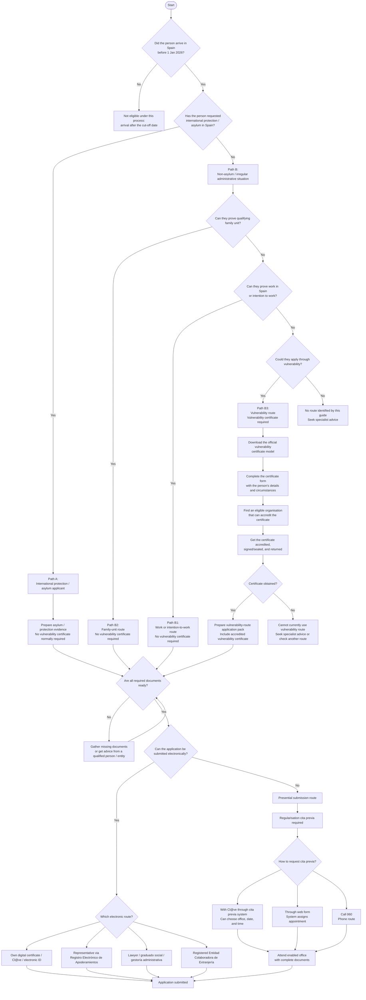

```mermaid
flowchart TD
    START([Start]) --> ARRIVED{Did the person arrive in Spain<br/>before 1 Jan 2026?}

    ARRIVED -- No --> NOT_ELIGIBLE_ARRIVAL[Not eligible under this process:<br/>arrival after the cut-off date]
    ARRIVED -- Yes --> ASYLUM{Has the person requested<br/>international protection / asylum in Spain?}

    %% Eligibility paths
    ASYLUM -- Yes --> PATH_A[Path A:<br/>International protection / asylum applicant]
    ASYLUM -- No --> PATH_B[Path B:<br/>Non-asylum / irregular administrative situation]

    PATH_A --> DOC_A[Prepare asylum / protection evidence<br/>No vulnerability certificate normally required]

    PATH_B --> FAMILY{Can they prove qualifying family unit?}

    FAMILY -- Yes --> DOC_B2[Path B2:<br/>Family-unit route<br/>No vulnerability certificate required]

    FAMILY -- No --> WORK{Can they prove work in Spain<br/>or intention to work?}

    WORK -- Yes --> DOC_B1[Path B1:<br/>Work or intention-to-work route<br/>No vulnerability certificate required]

    WORK -- No --> VULN{Could they apply through vulnerability?}

    VULN -- Yes --> VULN_NEED[Path B3:<br/>Vulnerability route<br/>Vulnerability certificate required]

    VULN -- No --> NO_ROUTE[No route identified by this guide<br/>Seek specialist advice]

    %% Vulnerability certificate branch
    VULN_NEED --> DOWNLOAD_CERT[Download the official vulnerability<br/>certificate model]
    DOWNLOAD_CERT --> COMPLETE_CERT[Complete the certificate form<br/>with the person's details and circumstances]
    COMPLETE_CERT --> FIND_CERTIFIER[Find an eligible organisation<br/>that can accredit the certificate]
    FIND_CERTIFIER --> ACCREDIT_CERT[Get the certificate accredited,<br/>signed/sealed, and returned]
    ACCREDIT_CERT --> CERT_OK{Certificate obtained?}

    CERT_OK -- Yes --> DOC_B3[Prepare vulnerability-route application pack<br/>Include accredited vulnerability certificate]
    CERT_OK -- No --> NO_VULN_CERT[Cannot currently use vulnerability route<br/>Seek specialist advice or check another route]

    %% Documents ready
    DOC_A --> DOC_READY{Are all required documents ready?}
    DOC_B1 --> DOC_READY
    DOC_B2 --> DOC_READY
    DOC_B3 --> DOC_READY

    DOC_READY -- No --> GATHER[Gather missing documents<br/>or get advice from a qualified person / entity]
    GATHER --> DOC_READY

    DOC_READY -- Yes --> ELECTRONIC{Can the application be submitted electronically?}

    %% Electronic routes
    ELECTRONIC -- Yes --> E_ROUTE{Which electronic route?}

    E_ROUTE --> OWN_CERT[Own digital certificate / Cl@ve / electronic ID]
    E_ROUTE --> APOD[Representative via Registro Electrónico de Apoderamientos]
    E_ROUTE --> PRO[Lawyer / graduado social / gestoría administrativa]
    E_ROUTE --> NGO[Registered Entidad Colaboradora de Extranjería]

    OWN_CERT --> SUBMITTED[Application submitted]
    APOD --> SUBMITTED
    PRO --> SUBMITTED
    NGO --> SUBMITTED

    %% Presential cita branch
    ELECTRONIC -- No --> PRESENTIAL[Presential submission route]
    PRESENTIAL --> NEED_CITA[Regularisation cita previa required]
    NEED_CITA --> CITA_METHOD{How to request cita previa?}

    CITA_METHOD --> CITA_CLAVE[With Cl@ve through cita previa system<br/>Can choose office, date, and time]
    CITA_METHOD --> CITA_FORM[Through web form<br/>System assigns appointment]
    CITA_METHOD --> CITA_PHONE[Call 060<br/>Phone route]

    CITA_CLAVE --> ATTEND[Attend enabled office<br/>with complete documents]
    CITA_FORM --> ATTEND
    CITA_PHONE --> ATTEND

    ATTEND --> SUBMITTED

    class START start;
    class NOT_ELIGIBLE_ARRIVAL,NO_ROUTE,NO_VULN_CERT stop;
    class ARRIVED,ASYLUM,FAMILY,WORK,VULN,CERT_OK,DOC_READY,ELECTRONIC,E_ROUTE,CITA_METHOD decision;
    class PATH_A,PATH_B,DOC_A,DOC_B1,DOC_B2,DOC_B3,VULN_NEED,DOWNLOAD_CERT,COMPLETE_CERT,FIND_CERTIFIER,ACCREDIT_CERT,GATHER,PRESENTIAL,NEED_CITA,CITA_CLAVE,CITA_FORM,CITA_PHONE,ATTEND,OWN_CERT,APOD,PRO,NGO action;
    class SUBMITTED success;
```