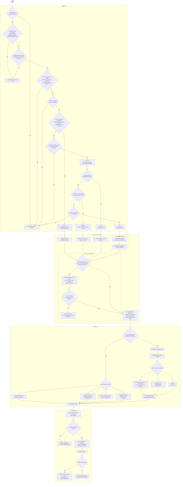

```mermaid
flowchart TD
    START([Start]) --> WINDOW{Within official<br/>application window?}

    subgraph eligibility [Eligibility]
        WINDOW -- No --> INELIGIBLE[Not eligible under this process]
        WINDOW -- Yes --> EXCLUDED{Already has active authorisation,<br/>Ukraine protection, statelessness route,<br/>or another separate route?}

        EXCLUDED -- Yes --> NOT_THIS_PROCESS[Use existing / separate route]
        EXCLUDED -- No --> PENDING{Already submitted arraigo /<br/>exceptional-circumstances application?}

        PENDING -- Yes --> NOT_THIS_PROCESS
        PENDING -- No --> STATUS{Are they currently in an irregular<br/>administrative situation or an eligible<br/>international protection applicant?}

        STATUS -- No --> INELIGIBLE
        STATUS -- Yes --> ARRIVED{Were they in Spain<br/>before 1 Jan 2026?}

        ARRIVED -- No --> INELIGIBLE
        ARRIVED -- Yes --> ASYLUM{Had they requested, registered,<br/>or formalised international protection<br/>in Spain before 1 Jan 2026?}

        ASYLUM -- Yes --> PATH_A[Path A:<br/>International protection / asylum applicant]
        ASYLUM -- No --> RECENT_PRESENCE{Were they in Spain during<br/>the 5 months before application?}

        RECENT_PRESENCE -- No --> INELIGIBLE
        RECENT_PRESENCE -- Yes --> PATH_B[Path B:<br/>Non-asylum / irregular administrative situation]

        PATH_B --> FAMILY{Are they part of a<br/>qualifying family unit?}

        FAMILY -- Yes --> PATH_B2[Path B2:<br/>Family-unit route]

        FAMILY -- No --> WORK{Have they worked in Spain<br/>or do they intend to work?}

        WORK -- Yes --> PATH_B1[Path B1:<br/>Work or intention-to-work route]

        WORK -- No --> VULN{Are they in a situation<br/>of vulnerability?}

        VULN -- Yes --> PATH_B3[Path B3:<br/>Vulnerability route]

        VULN -- No --> INELIGIBLE
    end

    subgraph documents [Document preparation]
        PATH_A --> DOC_A[Prepare asylum / protection evidence]

        PATH_B2 --> DOC_B2[Prepare family-unit route evidence]

        PATH_B1 --> DOC_B1[Prepare work or intention-to-work evidence]

        PATH_B3 --> COMPLETE_CERT

        subgraph vulnerability_certificate [Vulnerability certificate]
            COMPLETE_CERT[Complete the official vulnerability certificate form]
            COMPLETE_CERT --> DOC_B3[Get eligible organisation to accredit certificate]
        end

        DOC_A --> RECORDS_CHECK{Criminal / police record,<br/>public-order, public-security<br/>or public-health issue?}
        DOC_B1 --> RECORDS_CHECK
        DOC_B2 --> RECORDS_CHECK
        DOC_B3 --> RECORDS_CHECK

        subgraph criminal_records [Criminal / police records]
            RECORDS_CHECK -- Yes --> RESOLVE_RECORDS[Check whether the issue can be<br/>cancelled, suppressed, corrected,<br/>expired, or clarified]

            RESOLVE_RECORDS --> RECORDS_RESOLVED{Issue resolved,<br/>not relevant, or safe to proceed?}

            RECORDS_RESOLVED -- No --> DO_NOT_SUBMIT[Do not submit yet:<br/>records / public-order issue unresolved]
        end

        RECORDS_RESOLVED -- Yes --> COMMON_DOCS[Prepare common documents:<br/>identity document, dated presence evidence,<br/>criminal records, contact details]
        RECORDS_CHECK -- No --> COMMON_DOCS
    end

    subgraph submission [Submission]
        COMMON_DOCS--> ELECTRONIC{Can the application be submitted electronically?}

        ELECTRONIC -- Yes --> E_ROUTE{Which electronic route?}

        E_ROUTE --> OWN_CERT[Own digital certificate / Cl@ve / electronic ID]
        E_ROUTE --> APOD[Representative via Registro Electrónico de Apoderamientos]
        E_ROUTE --> PRO[Lawyer / graduado social / gestoría administrativa]
        E_ROUTE --> NGO[Registered Entidad Colaboradora de Extranjería]

        OWN_CERT --> SUBMITTED[Application submitted]
        APOD --> SUBMITTED
        PRO --> SUBMITTED
        NGO --> SUBMITTED

        ELECTRONIC -- No --> PRESENTIAL[Presential submission route]
        PRESENTIAL --> NEED_CITA[Regularisation cita previa required]
        NEED_CITA --> CITA_METHOD{How to request cita previa?}

        CITA_METHOD --> CITA_CLAVE[With Cl@ve through cita previa system<br/>Can choose office, date, and time]
        CITA_METHOD --> CITA_FORM[Through web form<br/>System assigns appointment]
        CITA_METHOD --> CITA_PHONE[Call 060<br/>Phone route]

        CITA_CLAVE --> ATTEND[Attend enabled office<br/>with complete documents]
        CITA_FORM --> ATTEND
        CITA_PHONE --> ATTEND

        ATTEND --> SUBMITTED
    end

    subgraph after_submission [After submission]
        SUBMITTED --> UTEX[Wait for UTEX start-of-procedure<br/>communication]
        UTEX --> START_NOTICE{Start communication received?}

        START_NOTICE -- No --> MONITOR[Monitor notifications<br/>and check contact details]
        MONITOR --> START_NOTICE

        START_NOTICE -- Yes --> WORK_RIGHTS[Work authorisation activated<br/>NUSS and healthcare recognition processed]
        WORK_RIGHTS --> WAIT_RESOLUTION[Wait for resolution]
        WAIT_RESOLUTION --> RESOLUTION{Resolution favourable?}

        RESOLUTION -- Yes --> TIE[Apply for TIE within one month<br/>at National Police documentation unit]
        RESOLUTION -- No --> APPEAL[Unfavourable resolution:<br/>appeal or alternative route]
    end

    class START start;
    class INELIGIBLE,NOT_THIS_PROCESS,DO_NOT_SUBMIT,APPEAL stop;
    class WINDOW,EXCLUDED,PENDING,STATUS,ARRIVED,RECENT_PRESENCE,ASYLUM,FAMILY,WORK,VULN,RECORDS_CHECK,RECORDS_RESOLVED,ELECTRONIC,E_ROUTE,CITA_METHOD,START_NOTICE,RESOLUTION decision;
    class PATH_A,PATH_B,PATH_B1,PATH_B2,DOC_B3,PATH_B3,DOC_A,DOC_B1,DOC_B2,DOC_B3,DOWNLOAD_CERT,COMPLETE_CERT,FIND_CERTIFIER,RESOLVE_RECORDS,COMMON_DOCS,PRESENTIAL,NEED_CITA,CITA_CLAVE,CITA_FORM,CITA_PHONE,ATTEND,OWN_CERT,APOD,PRO,NGO,UTEX,MONITOR,WORK_RIGHTS,WAIT_RESOLUTION,TIE action;
    class SUBMITTED success;
```
