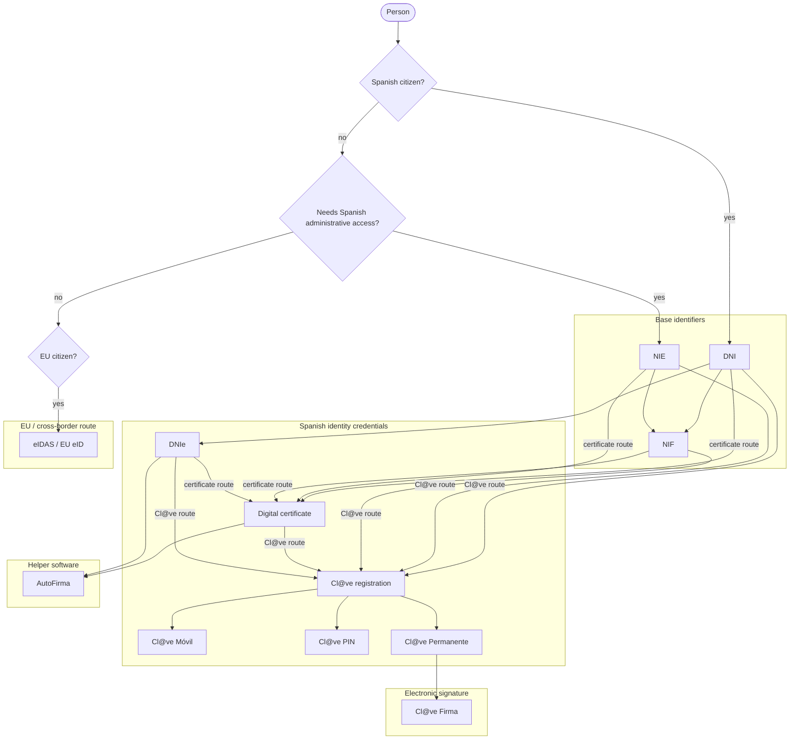

> **TL;DR:** Spain's digital identity system is best understood as four layers: identifiers, authentication methods, signature methods, and helper tools. DNI, NIE, and NIF identify people or organisations in administrative systems. Cl@ve, DNIe, certificates, and eIDAS are ways to authenticate. Digital certificates, DNIe, and Cl@ve Firma can support electronic signature. AutoFirma is not an identity method; it is helper software used to sign with a certificate or DNIe. For most users, Cl@ve is the easiest way to access services, while a digital certificate is the most useful option for completing and signing formal procedures.

## Categories of identity

| Category                        | Meaning                                                                                      | Examples                                                                   |
| ------------------------------- | -------------------------------------------------------------------------------------------- | -------------------------------------------------------------------------- |
| Base identifier                 | The administrative number used to identify a person or entity in Spanish systems.            | DNI, NIE, NIF                                                              |
| Physical/electronic ID document | A state-issued document that may include electronic identity certificates.                   | DNIe                                                                       |
| Authentication method           | A way to log in to public administration services.                                           | Cl@ve Móvil, Cl@ve PIN, Cl@ve Permanente, digital certificate, DNIe, eIDAS |
| Electronic signature method     | A way to produce a legally valid electronic signature.                                       | Digital certificate, DNIe, Cl@ve Firma                                     |
| Signing helper software         | Software used by public websites to apply a signature using a certificate or DNIe.           | AutoFirma                                                                  |
| Cross-border identity route     | A way for EU citizens to use another EU country's recognised eID to access Spanish services. | eIDAS / EU eID / eIdentifier                                               |

## Main identity and access methods

| Name                                         | Category                                                   | What it is for                                                                                                                                                                                                                                                                                                                                   |
| -------------------------------------------- | ---------------------------------------------------------- | ------------------------------------------------------------------------------------------------------------------------------------------------------------------------------------------------------------------------------------------------------------------------------------------------------------------------------------------------ |
| DNI                                          | Base identifier                                            | The national identity number for Spanish citizens. It is the basis for getting DNIe and many Spanish digital credentials.                                                                                                                                                                                                                        |
| NIE                                          | Base identifier                                            | The foreigner identity number. It is the key identifier for many non-Spanish citizens dealing with Spanish administration.                                                                                                                                                                                                                       |
| NIF                                          | Base identifier                                            | Tax identification number. For individuals this is often based on DNI or NIE; for organisations it is the main tax identifier.                                                                                                                                                                                                                   |
| DNIe                                         | Physical/electronic ID document; authentication; signature | The Spanish electronic ID card. It can be used to authenticate and sign, provided the user has the card, PIN, valid certificates, and compatible hardware/software.                                                                                                                                                                              |
| Digital certificate / electronic certificate | Authentication; signature                                  | A cryptographic certificate used to identify oneself and sign online procedures. Often the most broadly useful credential for serious administrative workflows.                                                                                                                                                                                  |
| FNMT certificate                             | Digital certificate                                        | The common public digital certificate issued by FNMT. Widely used for tax, Social Security, local government, and other administrative procedures.                                                                                                                                                                                               |
| Cl@ve                                        | Authentication system                                      | Spain's common public-sector electronic identification platform. It is an umbrella system, not one single credential. Officially, Cl@ve is a system for electronically identifying users in their relations with public administrations.                                                                                                         |
| Cl@ve Móvil                                  | Authentication method                                      | Mobile/app-based Cl@ve access. Useful for day-to-day access to public services.                                                                                                                                                                                                                                                                  |
| Cl@ve PIN                                    | Authentication method                                      | Temporary-code access, mainly for occasional users or one-off procedures.                                                                                                                                                                                                                                                                        |
| Cl@ve Permanente                             | Authentication method                                      | Username/password-based Cl@ve access, generally aimed at frequent users.                                                                                                                                                                                                                                                                         |
| Cl@ve Firma                                  | Electronic signature method                                | Cloud-based signature mechanism within the Cl@ve ecosystem. Useful where supported, but not universally available.                                                                                                                                                                                                                               |
| AutoFirma                                    | Signing helper software                                    | Desktop software used to sign procedures with a digital certificate or DNIe. It is not an identity or credential by itself. The government portal says users need AutoFirma for procedures that require signature with a certificate.                                                                                                            |
| eIDAS / EU eID / eIdentifier                 | Cross-border identity route                                | EU framework that allows citizens of one EU member state to use their national electronic ID to access public services in another member state. Spain's Tax Agency describes eIDAS as the mechanism allowing EU citizens to use another country's identification and authentication mechanisms to access public services in other member states. |

## By need

| Need                                                               | Usually suitable options                                                                | Notes                                                                                                                                                                                          |
| ------------------------------------------------------------------ | --------------------------------------------------------------------------------------- | ---------------------------------------------------------------------------------------------------------------------------------------------------------------------------------------------- |
| Identify a Spanish citizen administratively                        | DNI                                                                                     | Base identifier, not itself an online login unless using DNIe.                                                                                                                                 |
| Identify a foreign resident or non-Spanish person administratively | NIE, NIF                                                                                | Usually the starting point for Cl@ve or a certificate.                                                                                                                                         |
| Log in to public administration services                           | Cl@ve Móvil, Cl@ve PIN, Cl@ve Permanente, digital certificate, DNIe, eIDAS              | Availability varies by service.                                                                                                                                                                |
| Frequent access to government services                             | Cl@ve Móvil, Cl@ve Permanente, digital certificate                                      | Cl@ve is usually easier; certificate is more powerful.                                                                                                                                         |
| Occasional access                                                  | Cl@ve PIN, Cl@ve Móvil                                                                  | Good for users who do not want to manage certificates.                                                                                                                                         |
| Submit or sign formal procedures                                   | Digital certificate + AutoFirma, DNIe + AutoFirma, Cl@ve Firma where supported          | This is the critical distinction: authentication alone may not be enough.                                                                                                                      |
| Act on behalf of an organisation                                   | Organisation certificate, representative certificate, authorised representative systems | This deserves its own section if your page targets organisations.                                                                                                                              |
| Cross-border EU access                                             | eIDAS / EU eID                                                                          | Useful for EU citizens, but not a full replacement for Spanish identifiers. AEAT currently says EU citizens using eIDAS for its services need an identifier such as DNI, NIE, NIF L, or NIF M. |
| Integrate with Spanish public-sector login                         | Cl@ve, certificate-based auth, eIDAS depending on context                               | This depends heavily on whether the organisation is operating inside public-sector infrastructure, acting as a provider, or simply helping users navigate services.                            |

## Dependency graph

This diagram shows what you need in order to obtain each credential.

